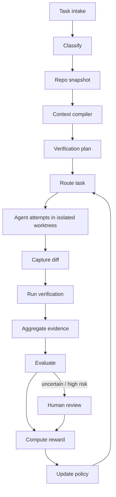

# Architecture

`acp` is a control plane that turns every coding-agent run into a reusable,
fully-traced training example. It is layered so each concern is testable in
isolation and swappable behind a protocol.

## System diagram

## Data lifecycle

Every entity (Task, RepoSnapshot, ContextPack, RoutingDecision, AgentAttempt,
CommandRun, DiffBundle, VerificationRun, Evidence, EvaluationResult,
HumanReviewItem/Label, WeakLabel, RewardEvent, PolicyVersion, PostMergeOutcome)
is a Pydantic schema (`src/acp/schemas/`) persisted via the `EntityStore`
(`src/acp/db/repositories.py`) into one queryable table + JSON `data` column.
Large blobs go to the content-addressed `ArtifactStore`.

## Layers

| Layer | Module | Responsibility |
|-------|--------|----------------|
| API | `acp.api` | FastAPI app + AppService |
| CLI | `acp.cli` | Typer commands + demos |
| Core | `acp.core` | config, ids, time, redaction, errors, artifacts, classifier, policies |
| DB | `acp.db` | SQLAlchemy models, EntityStore, Alembic |
| Schemas | `acp.schemas` | Pydantic contract layer |
| Workspaces | `acp.workspaces` | git worktrees + `CommandRunner` (security choke point) |
| Context | `acp.context` | indexer, parsers, retrieval, budgeter, compiler |
| Agents | `acp.agents` | Fake/Patch/Claude/Codex/OpenHands/SimpleLLM + registry |
| Verification | `acp.verification` | detectors, runners, evidence aggregation |
| Evaluation | `acp.evaluation` | objective, weak supervision, judges, HITL, active learning |
| Routing | `acp.routing` | features, heuristic, bandit, constraints, OPE, registry, reward |
| Orchestration | `acp.orchestration` | WorkflowState + durable 15-node runner |
| Observability | `acp.observability` | logging, tracing, metrics, JSONL exporter |

## Context compiler

`index → retrieve (hybrid keyword + vector + boosts) → budget (required-first,
dedupe, per-file/total caps) → immutable hashable ContextPack`. Same inputs →
same `content_hash`. See `docs/design/context_compiler.md`.

## Routing policy

`RoutingPolicy` protocol with a `HeuristicRouter` (v1) and a
`SimulatedBanditPolicy` (epsilon-greedy / Thompson). Every decision logs an
`action_probability` so logs are usable for off-policy evaluation (IPS/SNIPS).
Champion/challenger rollout via `PolicyRegistry`.

## Evaluation ladder

Objective evaluator → weak supervision (15 labeling functions) → LLM judges
(interface; fake deterministic judges in tests) → human review queue → active
learning selector. Reward (`compute_reward`) combines all signals with stored
components.

## Learning loop

`RoutingDecision` + `RewardEvent` feed the bandit (`observe_reward`) and the
supervised predictors. Post-merge outcomes mature rewards downward on revert.

## Deployment options

- Local: SQLite + local worktrees + Fake/Patch adapters (no keys).
- Production: Postgres + pgvector, real adapters, Docker/K8s workspaces, OTel
  export — all behind the same protocols.
